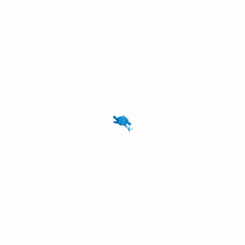

# `nov_fij_draw_logo` package
ROS 2 C++ package.  [](https://docs.ros.org/en/humble/)

This ROS2 package consists one of node, called `/draw_logo`. This node controls a turtle in turtlesim to draw a specific pattern (in this case, the logo of Széchenyi István University) based on predefined vectors and coordinates. It moves the turtle using linear and angular velocity commands while also teleporting it to certain locations - using the `/turtlesim/srv/TeleportAbsolute` service - to create a drawing. To control the pen's color, width, and visibility, it uses the `/turtlesim/srv/SetPen` service. It publishes movement commands using the `geometry_msgs/Twist` message type. After the drawing is completed, the node hides the turtle using the `/turtlesim/srv/Kill` service.

## Package, build and run

It is assumed that the workspace is `~/ros2_ws/`.

### Clone the package
``` r
cd ~/ros2_ws/src
```
``` r
git clone https://github.com/gera0719/nov_fij_draw_logo
```

### Build the package
``` r
cd ~/ros2_ws
```
``` r
colcon build --packages-select nov_fij_draw_logo --symlink-install
```
### Run the package
<details>
<summary> Don't forget to source before ROS commands.</summary>

``` bash
source ~/ros2_ws/install/setup.bash
```
</details>

#### Either

``` r
ros2 launch nov_fij_draw_logo logo_launch.py
```

#### or

``` r
ros2 run turtlesim turtlesim_node
```
``` r
ros2 run nov_fij_draw_logo draw_logo
```

## Sketch of the logo on a grid

<div align="center">
  
</div>

## Expected behaviour

<div align="center" >
  
</div>


## Mermaid diagram

